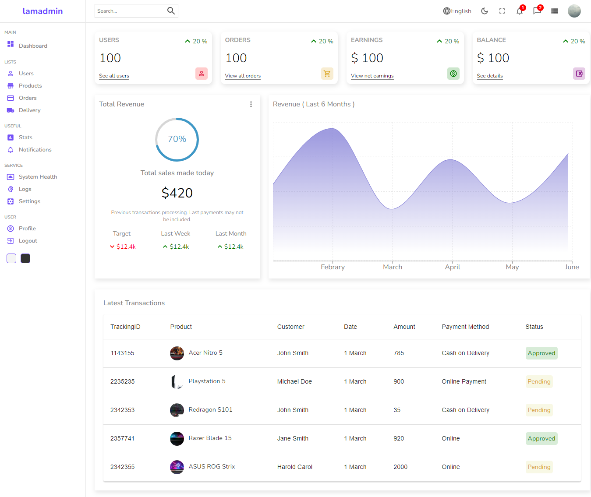

# lamadmin admin panel

A simple admin panel from [React Admin Panel Tutorial](https://youtu.be/yKV1IGahXqA?si=xRvgnWZlBn2fVfQP)

## Tech Stack

**Client:** React, Sass

## Run Locally

Clone the project

```bash
  git clone https://github.com/hafezfhmi/lamadmin-admin-panel.git
```

Go to the project directory

```bash
  cd lamadin-admin-panel
```

Install dependencies

```bash
  npm install
```

Start the server

```bash
  npm run start
```

## Screenshots



## Demo

https://lamadmin-admin-panel.hafezfhmi.com
